# 📝 Wishlist App

A simple, elegant, and fully offline **Wishlist Manager Android App** built using modern Android development practices. This app allows users to create, edit, and manage their wishes seamlessly with a clean UI and smooth interactions.

---

# 📱 App Overview

The **Wishlist App** helps users keep track of things they want — whether it's products, goals, or ideas — in a structured and organized way.

### 🔍 Problem it solves:
- People often forget ideas, goals, or things they want  
- Notes apps feel cluttered and unstructured  
- No simple, focused app for wishlist tracking  

👉 This app provides a **minimal, distraction-free experience** to manage wishes efficiently.

---

# ✨ Features

- ➕ Add new wishes (title + description)  
- ✏️ Edit existing wishes  
- 🗑 Swipe to delete with **Undo support**  
- 📦 Offline-first (Room Database)  
- ⚡ Reactive UI using Flow + Compose  
- 🎨 Clean and modern UI (Material 3)  
- 🔄 Smooth screen transitions with animations  
- 📭 Empty state UI with illustration  

---

# 🛠 Tech Stack

| Category        | Technology |
|----------------|-----------|
| Language       | Kotlin |
| UI             | Jetpack Compose |
| Architecture   | MVVM |
| Database       | Room |
| State Mgmt     | StateFlow + Compose State |
| Navigation     | Navigation Compose + Accompanist Animations |
| Async          | Coroutines |

---

# 🏗 Architecture

The app follows **MVVM (Model-View-ViewModel)** architecture with a clean separation of concerns.

### 📌 Layers:
- **UI (Compose)** → Displays data & handles user interaction  
- **ViewModel** → Business logic & state management  
- **Repository** → Data abstraction layer  
- **Room (DAO + DB)** → Local data storage  

---

## 🔁 Data Flow Diagram

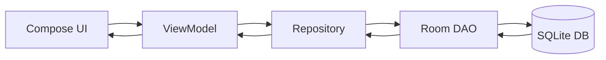

---

## 🔄 App Flow

1. User opens the app → sees wishlist items
2. If empty → shows illustration + prompt
3. User taps ➕ → navigates to Add Screen
4. User enters:
    * Title
    * Description
5. Clicks Add
6. Item appears in list instantly
7. User can:
    * Tap item → Edit
    * Swipe → Delete (with Undo option)
8. Snackbar allows undo within a short duration

---

## 🖼 Screenshots

<p>

### 🫟 Splash Screen
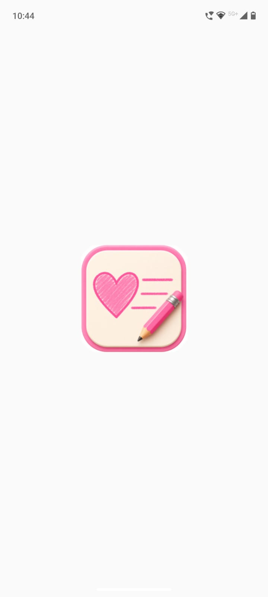

### 📱 Home Screen (Empty State)
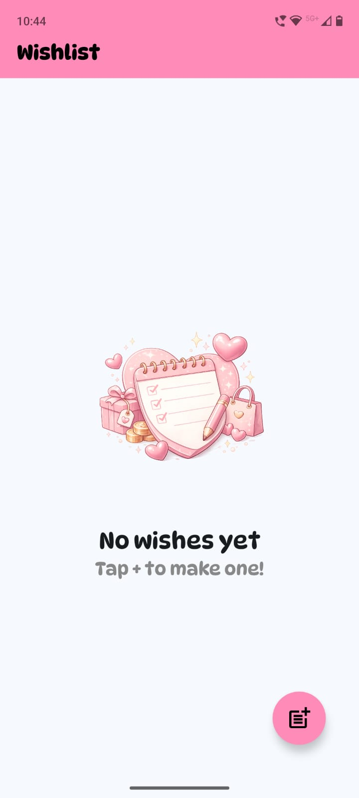

### ➕ Add Wish Screen
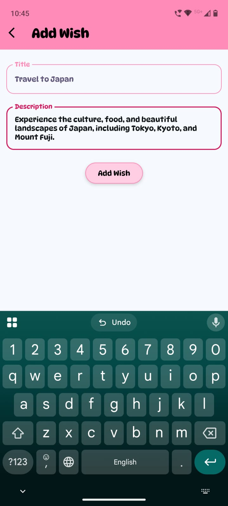

### ‼️ Wish Adding Snackbar
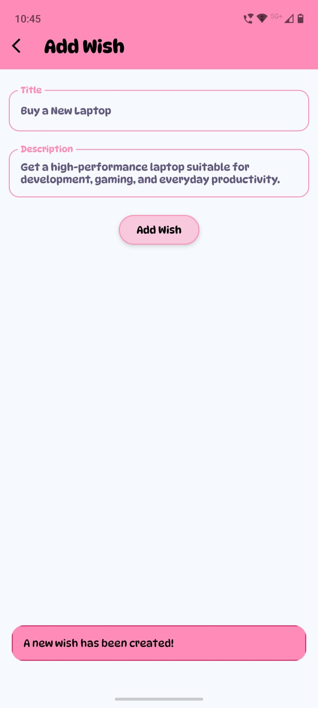

### 📝 Text length responsive textboxes
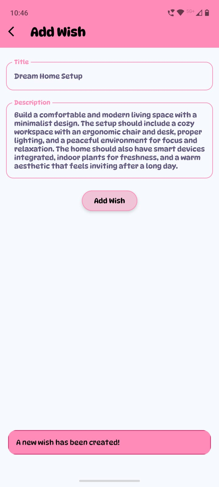

### ↕ Scrollable Lazy Column
<p>
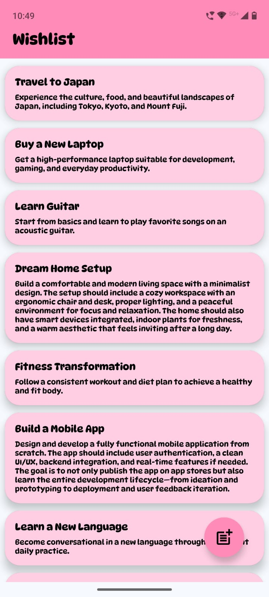
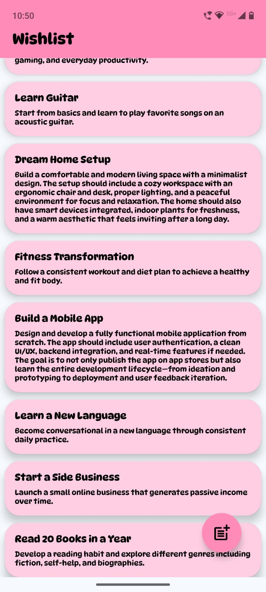
</p>

### ✏️ Edit Wish Screen
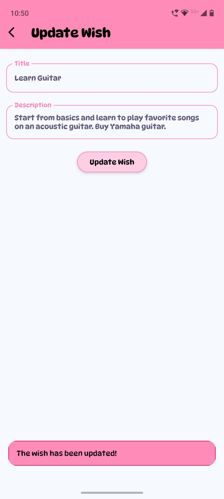

### ➡️ Right swipe -> snaps back
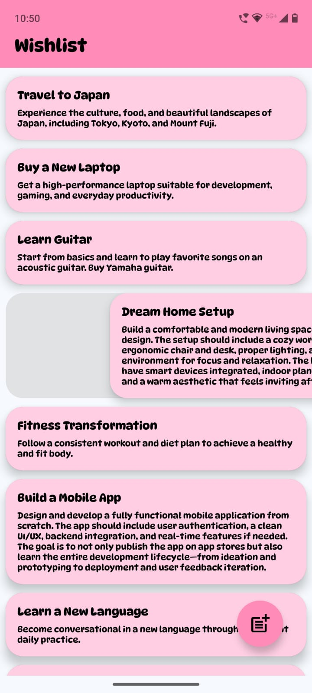

### 🗑 Swipe to Delete Action (left swipe)
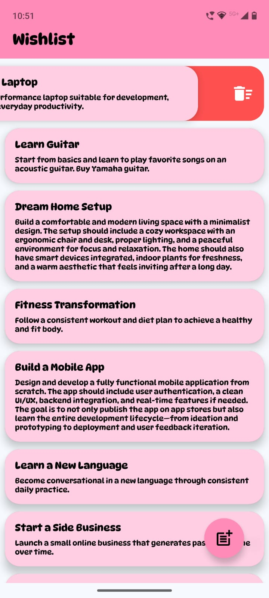
 
### ↩️ Undo Delete Snackbar
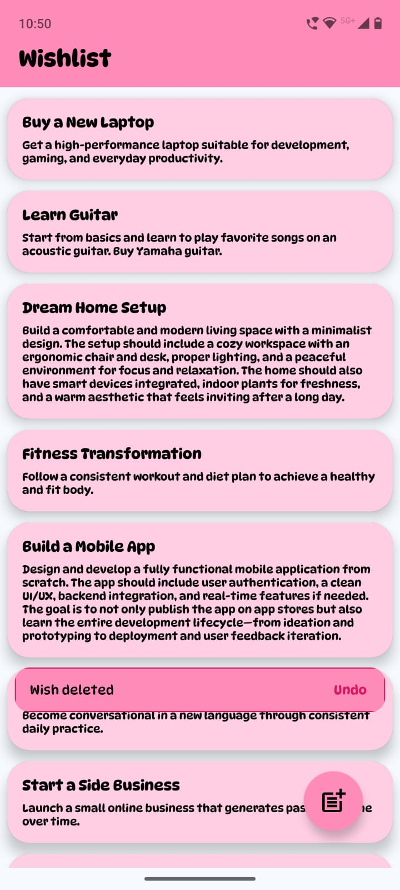

### 💾 Room Database Integration (reopening app)
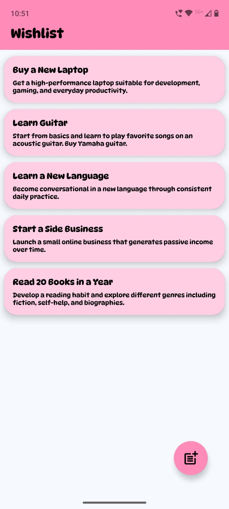

</p>

## 🎥 Demo
Check it out here : https://youtu.be/iZfAt8N_L74?si=yhnG65zA2GqRXgXf

---

## 🌐 API Integration

🚫 This app currently does not use any external APIs

## 📦 Data Handling:

* All data is stored locally using Room Database
* Uses Flow for reactive updates

## ⚠️ Error Handling:

* Input validation (empty fields)
* Safe database operations via coroutines

---

## 📂 Project Structure
```
kush.android.wishlistapp
│
├── data/
│   ├── Wish.kt              # Entity
│   ├── WishDao.kt           # DAO
│   ├── WishDatabase.kt      # Room DB
│   └── WishRepository.kt    # Repository
│
├── ui/
│   ├── HomeView.kt          # Main screen
│   ├── AddEditDetailsView.kt
│   ├── AppBar.kt
│
├── viewmodel/
│   └── WishViewModel.kt
│
├── navigation/
│   ├── Navigation.kt
│   └── Screen.kt
│
├── Graph.kt                 # Dependency provider
├── MainActivity.kt
└── WishlistApp.kt           # Application class
```

---

## 🎯 Use Cases

This app is useful for:

- 🛍 Tracking products to buy later  
- 🎯 Managing personal goals  
- 💡 Saving ideas  
- 📚 Keeping a reading/watch list  
- 🎁 Creating gift wishlists  

---

## 🚧 Future Improvements

- 🔍 Search & filter wishes  
- 📅 Add timestamps / deadlines  
- ☁️ Cloud sync (Firebase)  
- 🔐 User authentication  
- 🏷 Categories & tags  
- 📊 Analytics (usage insights)  
- 🌙 Dark mode improvements  
- 📤 Share wishlist  

---

## 💼 Portfolio & Freelancing

This project is part of my Android Development Portfolio.

💬 I’m open to:

- Freelancing projects  
- Android app development work  
- UI/UX improvements  
- Feature implementation & scaling  

👉 Feel free to reach out!

---

## ⭐ Support

If you found this project helpful:

- ⭐ Star the repo  
- 🍴 Fork it  
- 📢 Share with others
